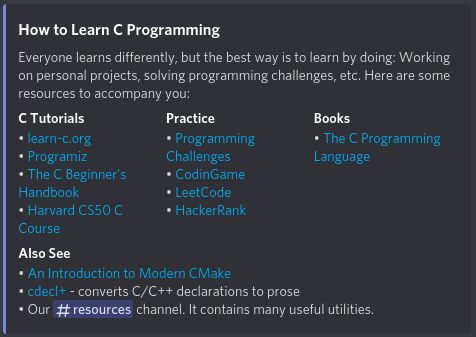

# tccpp-articles

[Together C &amp; C++ (Discord)](https://discord.gg/tccpp) articles for the `howto` command.
These articles have Markdown sources which are used to generate embeds on Discord.

All Markdown formatting which is available in Discord messages is also supported in the article, with a few additions:
- level 1 (`#`) and level 2 (`##`) headings are used to generate the embed title and embed fields
- a special `?footer` section is used to generate the footer of the embed
- named links with the format `[name](url)` can be used

## Example


```
# How to Learn C Programming

Everyone learns differently, but the best way is to learn by doing:
Working on personal projects, solving programming challenges, etc.
Here are some resources to accompany you:

## C Tutorials
?inline
- [learn-c.org](https://www.learn-c.org/)
- [Programiz](https://www.programiz.com/c-programming)
- [The C Beginner's Handbook](https://www.freecodecamp.org/news/the-c-beginners-handbook/)
- [Harvard CS50 C Course](http://cs50.edx.org/)

## Practice
?inline
- [Programming Challenges](https://discord.com/channels/331718482485837825/574580408407293954/668548805779652649)
- [CodinGame](https://www.codingame.com)
- [LeetCode](https://leetcode.com/)
- [HackerRank](https://www.hackerrank.com/)

## Books
?inline
- [The C Programming Language](https://www.amazon.com/Programming-Language-2nd-Brian-Kernighan/dp/0131103628)

## Also See
- [An Introduction to Modern CMake](https://cliutils.gitlab.io/modern-cmake/)
- [cdecl+](https://eisenwave.github.io/cdecl-plus/) - converts C/C++ declarations to prose
- Our <#574580408407293954> channel. It contains many useful utilities.
```

## Directives

In addition to regular Markdown formatting, addition directives can be used to control the embed.

#### `?inline`
Makes the current level 2 section *inline*, which will display the produced field side-by side with other inline fields.

#### `?footer`
Makes the current level 2 section the footer of the embed.
Markdown formatting is not possible in footers.

#### `?userAuthor`
Specifies that the embed author should be the user of the command.
Can be written anywhere.

#### `?commandFooter`
Specifies that the footer should be explain which command was used to post the embed.
Can be written anywhere.

#### `?creditFooter <id>`
Specifies that the footer should credit the Discord user with the given id.
Can be written anywhere.

#### `?icon <url>`
Specifies that the icon of the embed should have a given URL.
Can be written anywhere.

## Contributing

If you want to write an article, first look at the existing examples to see how it is done.
Keep the following principles in mind:
- **Keep it short**, you'd be surprised how little space there is an embed
- **Give a very quick and basic rundown**, all other information should be given in links
- **Link to any helpful resources**, which is the primary purpose of these articles

Howto articles are meant to provide a middle ground between giving someone a link to a resource,
and posting the entire resource in chat.
Neither of these options is convenient, because it takes someone away from the conversation,
or distrupts it too much.
Howto articles should be written so that they give the very most basic rundown about a topic,
with follow-up questions being expected.
